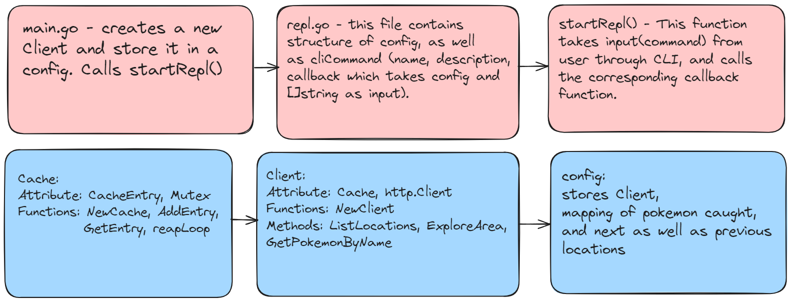

## Pokedex Go! 

**A Golang CLI Pokedex Application**

This project is a Golang command-line application inspired by the classic Pokemon game series. Users can explore different areas, encounter wild Pokemon, and capture them to build their own Pokedex. 

### Features

* Explore various areas and encounter wild Pokemon
* Catch Pokemon and add them to your Pokedex
* Inspect captured Pokemon and view their details

### Screenshots

.png)
.png)
.png)
.png)

###  Diagram explaining the architecture 



### Prerequisites

* Go 1.17 or later installed ([Download Go](https://golang.org/dl/))

### Installation

1. Clone this repository:

```bash
git clone https://github.com/naman1402/pokedex-golang.git
```

2. Navigate to the project directory:

```bash
cd pokedex-golang
```

### Running the application

1. Build the application:

```bash
go build
```

This will create an executable file named `pokedex-golang` in the project directory.

2. Run the application:

```bash
./pokedex-golang
```

The application will start and guide you through exploring areas, catching Pokemon, and managing your Pokedex.


